# Kothapalli Panduranga Praveen

<picture>
  <source media="(prefers-color-scheme: dark)" srcset="./dark.svg">
  <source media="(prefers-color-scheme: light)" srcset="./light.svg">
  
</picture>

## About

I am a CSE-AIML graduate focused on software development and practical AI/ML projects. My current technical foundation includes Python, Java, MERN, Spring Boot, Flask, OpenCV, Dlib, Angular, and JWT.

## Focus

- Software development with Python and Java
- Backend development with Spring Boot and Flask
- Full-stack development with MERN
- AI/ML and computer-vision projects
- Building practical applications while continuing to strengthen engineering fundamentals

## Education

**B.Tech — Computer Science & Engineering (AI/ML)**  
GMR Institute of Technology (GMRIT) · 2021–2025

## Featured Projects

### Sign Language to Speech
Flask-based sign recognition project with text-to-speech and emotion-detection integration.

### Driver Drowsiness Detection
Computer-vision project using OpenCV/Dlib concepts for blink and yawn detection with alerts.

### Online Doctor Appointment Booking
Web application developed for online doctor appointment booking.

### Parcel Management
Parcel-management application with a Spring Boot backend, with Angular integration and JWT concepts explored during development.

## Engineering Stack

**Languages:** Python · Java  
**Backend:** Spring Boot · Flask  
**Frontend / Full Stack:** MERN · Angular  
**AI / Computer Vision:** AI/ML · OpenCV · Dlib  
**Security / Integration:** JWT

## Connect

Links are intentionally omitted until verified profile URLs are supplied.

---

> This profile README is designed to keep the hero concise while leaving room for the repository's actual projects, experience, and links.
