<picture>
  <source media="(prefers-color-scheme: dark)" srcset="./dark.svg">
  <source media="(prefers-color-scheme: light)" srcset="./light.svg">
  
</picture>

<!-- TODO: add LinkedIn URL. Then replace the line below with:
[LinkedIn](https://www.linkedin.com/in/YOUR-HANDLE) · [Email](mailto:pandu350230@gmail.com)
-->
[Email](mailto:pandu350230@gmail.com)

## About

Software Engineer at TCS building and supporting enterprise applications across Azure, AWS and VMware. I automate releases with Azure DevOps, script away repetitive ops work in Python and Bash, and build full-stack and LLM-powered projects with React, Node.js and FastAPI.

## What I bring

- **Production engineering:** debugging, root cause analysis, log-based monitoring
- **Full-stack delivery:** React, Node.js/Express, SQL, REST APIs, Azure
- **Applied AI:** LLM + RAG, CNN-based computer vision

## Experience

**Software Engineer, Tata Consultancy Services (Kochi)** · Feb 2026 to present
- Resolved 20+ monthly production issues by analyzing logs and debugging application and infrastructure failures across Azure, AWS and VMware.
- Reduced deployment effort by 30% by automating release workflows with Azure DevOps CI/CD.
- Built Python and Bash scripts for log analysis, health checks and routine operational tasks.

**Full Stack Developer Intern, Awetecks Services Pvt. Ltd (Visakhapatnam)** · Aug 2024 to Nov 2024
- Built web application features with HTML, CSS, JavaScript, Node.js, Express.js and MongoDB, including REST APIs and backend functionality.
- Practiced API integration, debugging and secure coding in a collaborative team.

## Featured projects

**AI Resume Analyzer & Interview Assistant** <!-- TODO: add repo URL (and live demo URL if one exists) -->
Generates ATS feedback and interview questions using LLMs. Built a FastAPI backend and React frontend, with prompt engineering and RAG for context-aware responses.
`Python` `FastAPI` `React` `OpenAI API` `SQLite`

**Full-Stack Product Inventory Management System** <!-- TODO: add repo URL (and live demo URL if one exists) -->
Product management app with REST APIs and optimized SQL queries, deployed on Microsoft Azure.
`React` `Node.js` `Express.js` `MySQL` `Azure`

**Plant Disease Detection using Deep Learning** <!-- TODO: add repo URL (and live demo URL if one exists) -->
CNN model with 91% accuracy for plant disease classification, integrated into a Flask web app for real-time image-based prediction.
`Python` `TensorFlow` `Flask` `OpenCV`

## Tech stack

| | |
|---|---|
| **Languages** | Python, Java, SQL, JavaScript, Bash |
| **Backend** | Spring Boot, Node.js, Express.js, REST APIs, FastAPI |
| **Frontend** | React, HTML5, CSS3 |
| **Cloud & DevOps** | AWS, Microsoft Azure, Azure DevOps (CI/CD), Docker, Git, GitHub |
| **Databases** | MySQL, Microsoft SQL Server, SQLite, MongoDB |
| **AI/ML** | TensorFlow, OpenCV, OpenAI API, Prompt Engineering, RAG (project-level) |
| **Foundations** | Data Structures & Algorithms, OOP, DBMS |

Also familiar with IAM, RBAC and SIEM concepts.

## Education

B.Tech, Computer Science (AI & ML), GMR Institute of Technology · 2021 to 2025 · CGPA 8.42/10.0

<!--
GITHUB ACTIVITY (hidden by default). Enable once the contribution graph is strong:

-->

If you're hiring for software, full-stack or cloud-leaning roles, I'd be glad to hear from you.
